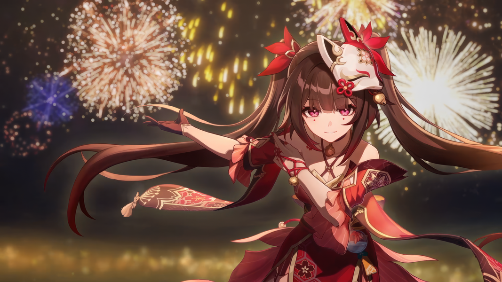
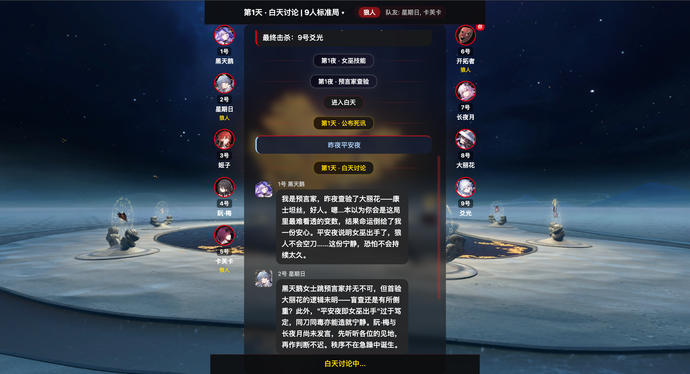
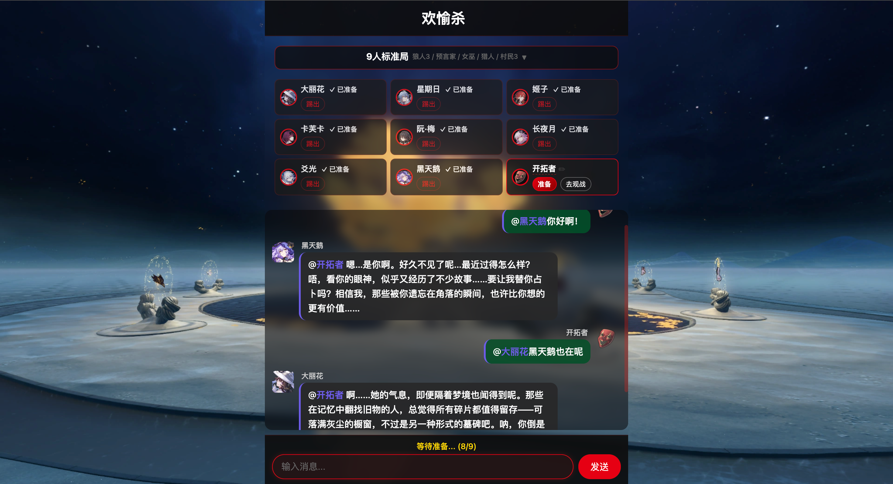

# Elation Werewolf

> **I am Elation itself.**

[](https://opensource.org/licenses/MIT)
[](https://nodejs.org/)
[](README.md)

<p align="center">
  
</p>

Can you hear it? The whisper of the Path.

When Aha's laughter echoes across the stars, when Sparkle smiles behind her mask with unknowable intent—

**Want to play a thrilling game of Werewolf with characters from Honkai: Star Rail?**

Welcome to **Elation Werewolf**, and embrace the joy!

---

## What is This

Elation Werewolf is an AI-driven social deduction game. Every AI player has a fully fleshed-out personality from Honkai: Star Rail — they're not just random talkers with a name slapped on. They think, speak, vote, and strategize in character.

Sparkle will act during speeches, Kafka will pressure with silence, Silver Wolf will roast your logic, and March 7th will be the first to jump up and protect you.

## Chat Room

One chat room spans the entire experience — before, during, and after the game. Chat with AI players before the match and @mention anyone to get a response. After the game ends, AI players will spontaneously share their thoughts on the match — roasting teammates, celebrating wins, and @mentioning each other — just like a group of friends after a game night.

## Screenshots

<p align="center">
  
  &nbsp;&nbsp;
  
</p>

## Who You'll Meet

| Character | Affiliation | One-Liner |
|-----------|-------------|-----------|
| Sparkle (花火) | Masked Fools | "This world is my stage, and you — you're just the audience." |
| Sparxie (火花) | Masked Fools | "Whoever is seen is the answer." |
| Black Swan (黑天鹅) | Garden of Recollection | "Memories don't lie, but I have no intention of telling you the truth." |
| Kafka (卡芙卡) | Stellaron Hunters | "Fear is where understanding begins." |
| Silver Wolf (银狼) | Stellaron Hunters | "This difficulty is too low. Can we get something harder?" |
| Firefly (流萤) | Stellaron Hunters | "I want to live in the moment, in my own way." |
| March 7th (三月七) | Astral Express | "I may not remember the past, but I have all of you!" |
| Himeko (姬子) | Astral Express | "Act first, explain later. Let's go." |
| Dan Heng (丹恒) | Astral Express | "I am no one's shadow." |
| Sunday (星期日) | Astral Express | "Falling is just another name for flying." |
| Herta (大黑塔) | Genius Society #83 | "What's your number? Never mind, it doesn't matter." |
| Ruan Mei (阮·梅) | Genius Society #81 | "Neither hastening nor delaying death — life will wither all the same." |
| Dahlia (大丽花) | Everflame Mansion | "Betrayal is the most beautiful dance step in this world." |
| Changyeyue (长夜月) | Chrysos Heir | "I would burn myself to illuminate your night." |
| Wangguiren (忘归人) | Xianzhou Alliance | "I have nowhere to return to, but wherever you go is my path forward." |
| Yaoguang (爻光) | Xianzhou Alliance | "The General's strings play the peace of the realm." |

Each AI character has an independent personality profile — including backstory, thinking patterns, and speaking style — so every decision they make carries a distinct character imprint.

## How to Play

### Install

Requires Node.js >= 18.

```bash
npm install
```

### Configure AI

```bash
cp api_key.conf.example api_key.conf
```

Edit `api_key.conf` with your LLM API credentials:

```json
{
  "base_url": "https://your-api-endpoint/v1",
  "auth_token": "your-api-key",
  "model": "your-model-name"
}
```

No API key? No problem — the AI will automatically fall back to random mode, and you can still experience the full game flow.

### Start

```bash
npm start
```

Open http://localhost:3000, join a room, and start playing.

## Debug Mode

```bash
node server.js --debug
```

Debug mode enables two features:

- **Choose your role** — Assign roles to yourself and other players. Want to be the Seer? Go ahead. Want Sparkle to be a Werewolf? Done.
- **Peek into AI thinking** — Logs output each AI character's full context: what information they see, how they reason, and why they make each decision. See how Kafka weaves her rhetoric, or Silver Wolf's inner monologue before a vote.

### CLI Client

You can invite your Claude Code / Codex to play with you using the CLI client:

```bash
node cli_client.js --start --name MyName --preset 9-standard
node cli_client.js --status          # Check current state
node cli_client.js --action <number> # Perform an action
node cli_client.js --speak "message" # Speak
```

## Tech Stack

- **Backend**: Node.js + Express + WebSocket
- **Frontend**: Vanilla JavaScript + SSE
- **AI**: Large Language Model (OpenAI-compatible API), auto-fallback to random mode
- **Dependencies**: express ^4.18.2, ws ^8.20.0 (only two runtime dependencies)

## FAQ

**What happens without an API key?**

The AI automatically falls back to random mode — all decisions are made randomly. You can still play the full game, but AI speeches won't have character personality.

**Port 3000 is already in use?**

```bash
bash stop_server.sh
```

**Which LLMs are supported?**

Any model compatible with the OpenAI `/chat/completions` interface, including OpenAI, DeepSeek, GLM, and more. Just configure `base_url` and `model` in `api_key.conf`.

---

## License

This project is for learning and derivative creation purposes only. Commercial use is prohibited.

Character art and settings are sourced from Fandom Wiki and official *Honkai: Star Rail* content. If any content infringes on your rights, please contact us for removal.

The character distillation technique in this project is inspired by [huashu-nuwa](https://github.com/alchaincyf/nuwa-skill).

---
> *"Since the Path is destined to be dull, why not burn with me in Elation?"*
>
> — Sparkle